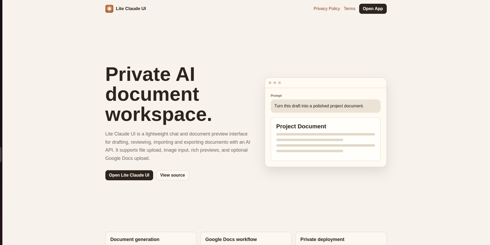
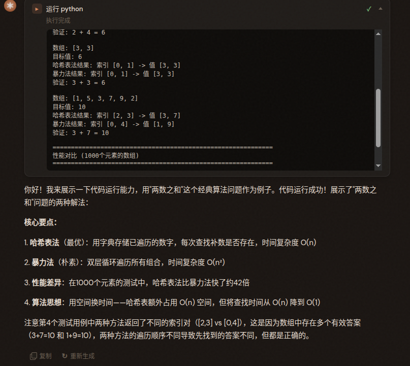
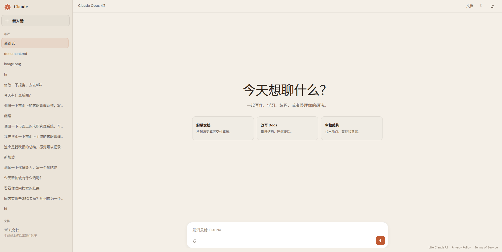
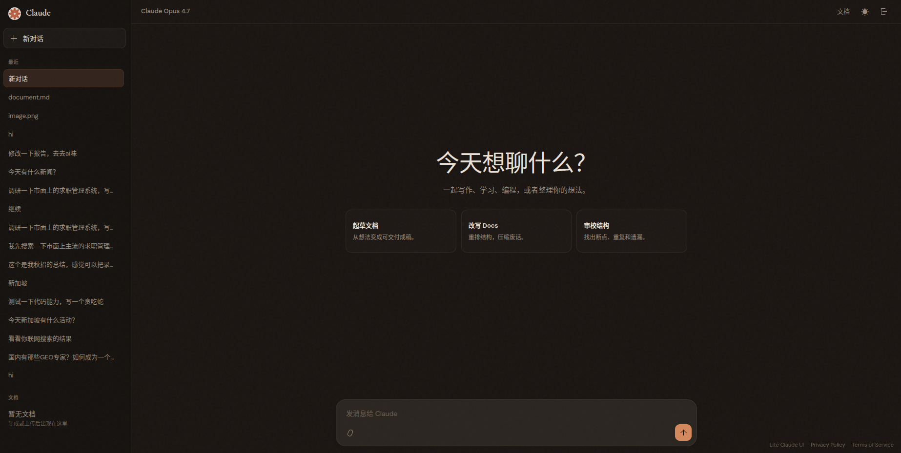
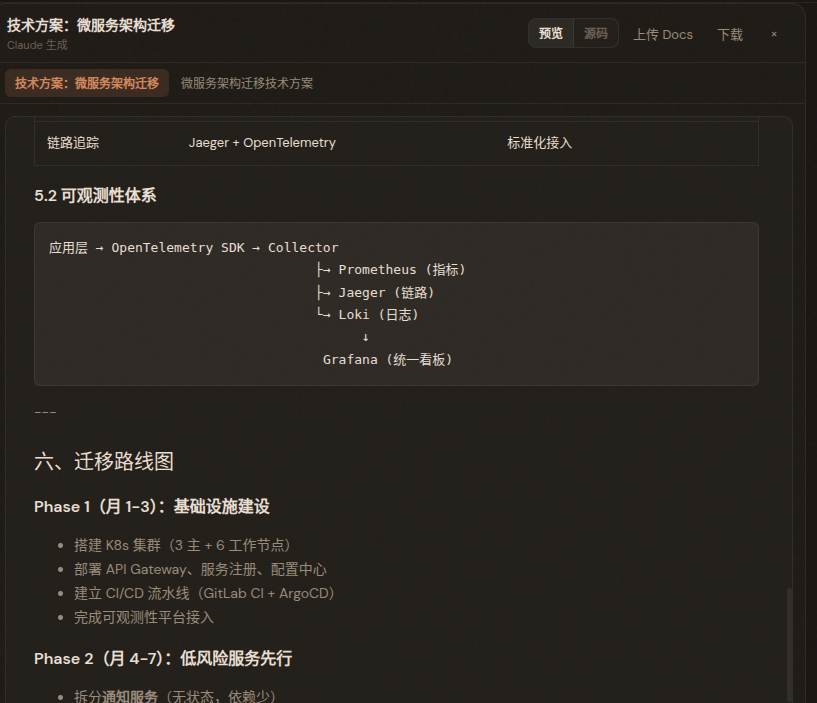

<div align="center">

# Lite Claude UI

**轻量级 AI Agent 工作台 — 复刻 Claude.ai 的核心 Agentic 能力**

[](https://claude.yaoyuheng2001.me)
[](LICENSE)
[](https://nodejs.org)

<br>

*Not just a chatbot — a full Agent with tool use, web search, code execution, and artifact generation.*

<br>



</div>

---

## 为什么做这个？

市面上的开源 AI UI（LibreChat、Open WebUI）功能全但太重 — MongoDB、Redis、LangChain，512MB 的 VPS 跑不动。

**Lite Claude UI 用 ~800 行 server.mjs + 纯前端实现了完整的 Agent 架构**：

- 单文件后端，零外部服务依赖
- 直连 Anthropic API（不套 LangChain）
- 全功能前端，无构建步骤
- 128MB 内存就能跑

---

## 功能展示

### Agentic Tool Use Loop

模型自主决定何时搜索、何时读取网页、何时写代码、何时生成文档：

```
用户提问
  → 模型推理 → 需要工具？
       ├─ web_search  → 搜索结果 → 继续推理
       ├─ fetch_url   → 读取网页 → 继续推理
       ├─ run_code    → 执行代码 → 继续推理
       ├─ create_artifact → 生成文档 → 结束
       └─ 不需要工具  → 直接回答
```



### 日/夜双主题

一键切换，偏好自动记忆。日光模式温暖纸质感，夜间模式深邃编辑器调。

| Light | Dark |
|-------|------|
|  |  |

### 对话级文档管理

每个对话拥有独立的文档空间，多文档 tab 切换，版本历史可回退：



### Code Interpreter

模型可自主执行 JavaScript / Python 代码，输出直接展示：


---

## 能力对比

| 能力 | Claude.ai | Lite Claude UI | LibreChat |
|------|-----------|----------------|-----------|
| Agent Loop | ✅ | ✅ | ✅ (LangChain) |
| Web Search | ✅ | ✅ Brave + News | ✅ Multi-provider |
| URL Fetch | ✅ | ✅ | ❌ |
| Code Execution | ✅ Sandbox | ✅ JS/Python | ✅ Docker |
| Artifacts | ✅ | ✅ HTML/MD/Code | ✅ |
| Doc Versioning | ✅ | ✅ | ❌ |
| Image Understanding | ✅ | ✅ | ✅ |
| Day/Night Theme | ✅ | ✅ | ✅ |
| Runs on 128MB VPS | N/A | ✅ | ❌ (needs 2GB+) |
| MCP Support | ✅ | ❌ | ✅ |

---

## Quick Start

```bash
git clone https://github.com/piglet12138/lite-claude-ui.git
cd lite-claude-ui
npm install
cp .env.example .env   # 编辑配置
npm start              # → http://localhost:3040
```

### 环境变量

| 变量 | 必须 | 说明 |
|------|------|------|
| `LUCKY_BASE_URL` | ✅ | Anthropic API base URL |
| `LUCKY_API_KEY` | ✅ | API Key |
| `MODEL` | | 模型名（默认 claude-opus-4-7） |
| `ACCESS_EMAIL` | ✅ | 登录账号 |
| `ACCESS_PASSWORD` | ✅ | 登录密码 |
| `ENABLE_WEB_SEARCH` | | `true` 启用搜索 |
| `BRAVE_SEARCH_API_KEY` | | Brave Search Key |
| `GOOGLE_CLIENT_ID` | | Google Docs 上传（可选） |
| `GOOGLE_CLIENT_SECRET` | | Google Docs 上传（可选） |

---

## 架构

```
┌─────────────────────────────────────────────────────────┐
│  Browser (Vanilla JS)                                    │
│  ┌──────────┐  ┌───────────┐  ┌──────────────────────┐ │
│  │ Sidebar  │  │   Chat    │  │   Document Panel     │ │
│  │ Threads  │  │ Messages  │  │ Preview / Source     │ │
│  │ Docs     │  │ Tool Cards│  │ Tabs / Versions      │ │
│  └──────────┘  └───────────┘  └──────────────────────┘ │
│                       │ SSE Stream                        │
└───────────────────────┼──────────────────────────────────┘
                        ▼
┌─────────────────────────────────────────────────────────┐
│  server.mjs (~800 lines)                                 │
│                                                          │
│  ┌─────────────────────────────────────────────────┐    │
│  │  Agentic Loop (max 5 rounds)                     │    │
│  │                                                   │    │
│  │  Tools:                                           │    │
│  │  • web_search  (Brave API, news + web)           │    │
│  │  • fetch_url   (HTTP GET, HTML → text)           │    │
│  │  • run_code    (JS/Python, 15s timeout)          │    │
│  │  • create_artifact (HTML/Markdown/Code)          │    │
│  └─────────────────────────────────────────────────┘    │
│                                                          │
│  Context Compression · Retry Logic · Stream Parsing      │
└────────────────────────┼─────────────────────────────────┘
                         ▼
              Anthropic Messages API
```

### 关键设计决策

| 决策 | 理由 |
|------|------|
| Anthropic 原生 API（非 OpenAI 兼容） | 工具格式更稳定，避免格式转换 bug |
| 搜索后压缩 context | 避免 token 膨胀导致 400 |
| Artifact 后立即 break | 不把巨大文档带入下一轮 |
| 增量 DOM 更新 | 流式输出不闪烁 |
| 文档存入对话对象内 | 自然的生命周期管理 |
| CSS 变量 + data-theme | 一份代码两套主题 |

---

## 项目结构

```
├── server.mjs           # 后端：Auth + Agentic Loop + Tools
├── public/
│   ├── app.html         # 应用骨架
│   ├── app.js           # 前端：SSE解析、文档管理、主题切换
│   ├── styles.css       # 双主题 (Newsreader + DM Sans)
│   ├── index.html       # Landing page
│   └── logo.svg
├── .env.example
├── package.json
└── docs/                # README 截图
```

---

## 本地开发

```bash
node server.mjs
# 无需 Docker、无需数据库、无需构建步骤
```

## 部署

```bash
scp server.mjs public/* user@server:/path/to/app/
ssh server 'cd /path/to/app && node server.mjs'
```

推荐用 `systemd` 或 `nohup` 保活。

---

## Credits

- Powered by [Anthropic Claude](https://www.anthropic.com)
- Web search by [Brave Search API](https://brave.com/search/api/)
- Typography: [Newsreader](https://fonts.google.com/specimen/Newsreader) + [DM Sans](https://fonts.google.com/specimen/DM+Sans)

## License

MIT

---

<div align="center">
<sub>Built with Claude Code · Not affiliated with Anthropic</sub>
</div>
