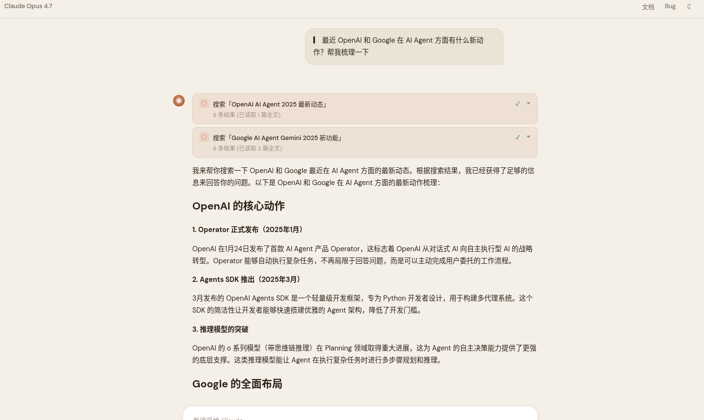
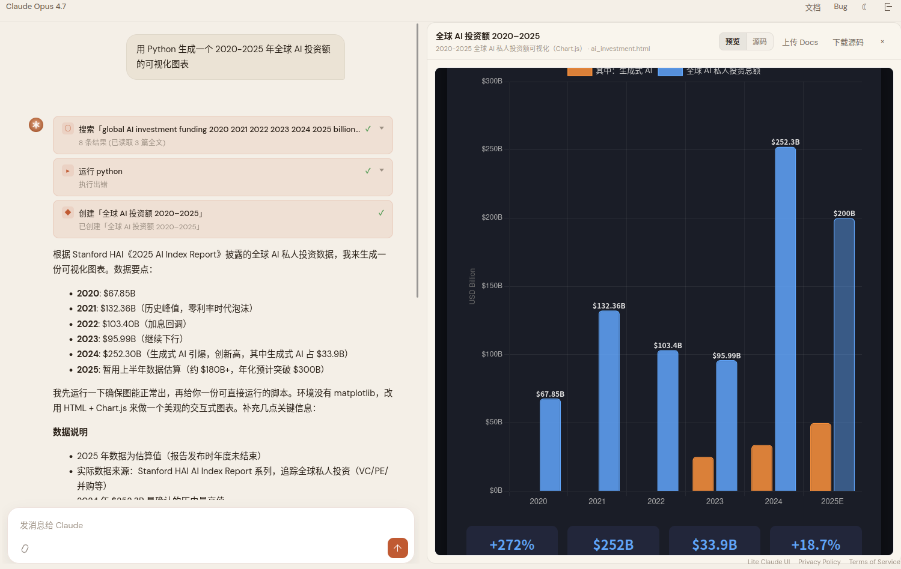
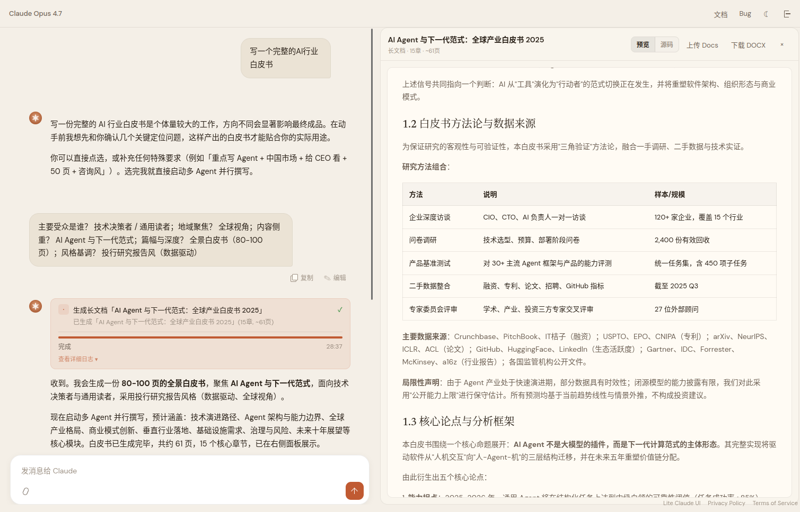

<div align="center">

# Claude AI Harness

**轻量级 AI Agent Harness — 复刻 Claude.ai 的核心 Agentic 能力**

[](https://claude.yaoyuheng2001.me)
[](LICENSE)
[](https://nodejs.org)
[](https://juejin.cn/post/7637353693051781166)

<br>

*Not just a chatbot — a full Agent harness with tool use, web search, code execution, file generation, and artifact management.*

<br>


</div>

---

## 为什么叫 Harness？

这不是一个 Chat UI。它是一个 **Agent Harness** — 模型的执行环境。

就像 Claude Code 是 Claude 在终端里的 harness，Claude AI Harness 是 Claude 在浏览器里的 harness。模型在这里拥有搜索、读网页、跑代码、生成文件、创建文档的完整能力链，自主决定何时用什么工具。

市面上的开源方案（LibreChat、Open WebUI）功能全但太重 — MongoDB、Redis、LangChain，512MB 的 VPS 跑不动。**Claude AI Harness 用单文件 server.mjs + 纯前端实现了完整的 Agent 架构**：

- 单文件后端，零外部服务依赖
- 直连 Anthropic API（不套 LangChain）
- 全功能前端，无构建步骤
- 128MB 内存就能跑

---

## 核心能力

### Agentic Tool Use Loop

模型自主决定何时搜索、何时读取网页、何时写代码、何时生成文档：

```
用户提问
  → 模型推理 → 需要工具？
       ├─ web_search    → 搜索结果 → 继续推理
       ├─ fetch_url     → 读取网页 → 继续推理
       ├─ run_code      → 执行代码 / 生成文件 → 继续推理
       ├─ create_artifact → 生成文档 → 结束
       └─ 不需要工具    → 直接回答
```

**搜索 + 深度阅读：** 模型自主搜索多个角度，自动读取全文后回答



**搜索 + 代码执行 + 可视化：** 搜索真实数据 → 尝试 Python → 自动切换 Chart.js 方案



### Office 文件生成（Anthropic Skills 集成）

`run_code` 内置 Office 文件生成能力，基于 [Anthropic Skills](https://github.com/anthropics/skills) 的知识：

| 格式 | 库 | 语言 |
|------|-----|------|
| Word (.docx) | docx-js | JavaScript |
| Excel (.xlsx) | openpyxl | Python |
| PowerPoint (.pptx) | pptxgenjs | JavaScript |
| PDF (.pdf) | reportlab | Python |

生成的文件自动出现在文档面板，可直接下载。和 Claude.ai 的 artifact 管理体验一致。


### 日/夜双主题

一键切换，偏好自动记忆。日光模式温暖纸质感，夜间模式深邃编辑器调。

| Light | Dark |
|-------|------|
|  |  |

### 交互式选项 & 文档生成

模型主动提问明确需求，用户点选后生成高质量文档：


### 对话级文档管理

每个对话拥有独立的文档空间，多文档 tab 切换，版本历史可回退：


### 长文档并行生成

多个子 Agent 并行撰写各章节，支持 50-100 页长篇文档，可预览和导出 DOCX：



---

## 能力对比

| 能力 | Claude.ai | Claude AI Harness | LibreChat |
|------|-----------|-------------------|-----------|
| Agent Loop | ✅ | ✅ | ✅ (LangChain) |
| Web Search | ✅ | ✅ 5-engine Fallback | ✅ Multi-provider |
| URL Fetch | ✅ | ✅ | ❌ |
| Code Execution | ✅ Sandbox | ✅ JS/Python | ✅ Docker |
| Artifacts | ✅ | ✅ HTML/MD/Code | ✅ |
| **Office File Gen** | ✅ | ✅ DOCX/XLSX/PPTX/PDF | ❌ |
| Long Doc Generation | ✅ | ✅ Multi-agent | ❌ |
| DOCX Export | ✅ | ✅ | ❌ |
| Doc Versioning | ✅ | ✅ | ❌ |
| Image Understanding | ✅ | ✅ | ✅ |
| Day/Night Theme | ✅ | ✅ | ✅ |
| SQLite Persistence | N/A | ✅ | ✅ (MongoDB) |
| Mobile Optimized | ✅ | ✅ | ✅ |
| Stop & Edit | ✅ | ✅ | ✅ |
| Interactive Options | ✅ | ✅ | ❌ |
| Follow-up Suggestions | ✅ | ✅ | ❌ |
| 文档分享 | N/A | ✅ 临时链接 | ❌ |
| Runs on 128MB VPS | N/A | ✅ | ❌ (needs 2GB+) |

---

## Quick Start

```bash
git clone https://github.com/piglet12138/claude-ai-harness.git
cd claude-ai-harness
npm install
pip install openpyxl reportlab pypdf   # Office 文件生成依赖
cp .env.example .env   # 编辑配置
npm start              # → http://localhost:3040
```

### 环境变量

| 变量 | 必须 | 说明 |
|------|------|------|
| `ANTHROPIC_BASE_URL` | ✅ | API base URL（默认 `https://api.anthropic.com/v1`） |
| `ANTHROPIC_API_KEY` | ✅ | Anthropic API Key |
| `MODEL` | | 模型名（默认 claude-opus-4-7） |
| `ACCESS_EMAIL` | ✅ | 登录账号 |
| `ACCESS_PASSWORD` | ✅ | 登录密码 |
| `ENABLE_WEB_SEARCH` | | `true` 启用搜索 |
| `BRAVE_SEARCH_API_KEY` | | Brave Search Key |
| `SERPER_API_KEY` | | [Serper.dev](https://serper.dev) Key (Google results) |
| `TAVILY_API_KEY` | | [Tavily](https://tavily.com) Key (AI search) |
| `GOOGLE_CSE_API_KEY` | | Google Custom Search API Key |
| `GOOGLE_CSE_CX` | | Google CSE Engine ID |
| `GOOGLE_CLIENT_ID` | | Google Docs 上传（可选） |
| `GOOGLE_CLIENT_SECRET` | | Google Docs 上传（可选） |

---

## 架构

```
┌─────────────────────────────────────────────────────────────┐
│  Browser (Vanilla JS)                                       │
│  ┌──────────┐  ┌───────────┐  ┌────────────────────────┐   │
│  │ Sidebar  │  │   Chat    │  │   Document Panel       │   │
│  │ Threads  │  │ Messages  │  │ Artifacts / Files      │   │
│  │ Docs     │  │ Tool Cards│  │ Preview / Download     │   │
│  └──────────┘  └───────────┘  └────────────────────────┘   │
│                       │ SSE Stream                           │
└───────────────────────┼─────────────────────────────────────┘
                        ▼
┌─────────────────────────────────────────────────────────────┐
│  server.mjs + db.mjs                                        │
│                                                             │
│  ┌───────────────────────────────────────────────────────┐  │
│  │  Agentic Loop (max 8 rounds, token budget mgmt)       │  │
│  │                                                       │  │
│  │  Tools:                                               │  │
│  │  • web_search  (5-engine fallback + auto-fetch)       │  │
│  │  • fetch_url   (HTTP GET, HTML → text)                │  │
│  │  • run_code    (JS/Python + Office file generation)   │  │
│  │  • create_artifact (HTML/Markdown/Code)               │  │
│  │  • generate_long_document (多agent并行, 50-100页)     │  │
│  └───────────────────────────────────────────────────────┘  │
│                                                             │
│  File Store (.generated-files/) · Context Compression       │
│  API Key Pool · Retry Logic · Stream Parsing                │
└─────────────────────────┼───────────────────────────────────┘
                          ▼
               Anthropic Messages API
```

### 关键设计决策

| 决策 | 理由 |
|------|------|
| Anthropic 原生 API（非 OpenAI 兼容） | 工具格式更稳定，避免格式转换 bug |
| 搜索后压缩 context | 避免 token 膨胀导致 400 |
| Artifact 后立即 break | 不把巨大文档带入下一轮 |
| 增量 DOM 更新 | 流式输出不闪烁 |
| 文档存入对话对象内 | 自然的生命周期管理 |
| CSS 变量 + data-theme | 一份代码两套主题 |
| SQLite + localStorage 双层 | 服务端持久 + 前端缓存加速首屏 |
| 5 引擎 Fallback 搜索 | 最大化免费额度，保证可用性 |
| 搜索后自动抓取全文 | 摘要不够深，全文才能支撑深度回答 |
| Token 预算管理 (80K) | 主动压缩上下文，防止 API 400 错误 |
| .cjs + module resolve 注入 | 让 run_code 的 JS 能 require() npm 包 |
| 文件 sidecar .meta.json | 服务重启后自动恢复文件下载链接 |

---

## 项目结构

```
├── server.mjs           # 后端：Auth + Agentic Loop + Tools + Search + File Store
├── db.mjs               # SQLite 存储层（用户/会话/对话/消息/文档）
├── public/
│   ├── app.html         # 应用骨架
│   ├── app.js           # 前端：SSE解析、文档管理、文件下载、主题切换
│   ├── styles.css       # 双主题 (Newsreader + DM Sans)
│   ├── index.html       # Landing page
│   └── logo.svg
├── .generated-files/    # 生成的 Office 文件（自动创建，7天过期）
├── .env.example
├── package.json
└── docs/                # README 截图
```

---

## 本地开发

```bash
node server.mjs
# 无需 Docker、无需数据库、无需构建步骤
```

## 部署

```bash
scp server.mjs db.mjs package.json public/* user@server:/path/to/app/
ssh server 'cd /path/to/app && npm install && pip install openpyxl reportlab pypdf && node server.mjs'
```

推荐用 `systemd` 或 `nohup` 保活。

---

## 更新日志

### 2026-05-23 — 跨对话长期记忆 & Prompt Caching & 主动压缩

**跨对话长期记忆（新增）：**
- 新增 `user_memory(user_id, content, updated_at)` 表，一行一用户、4000 字符上限
- 新增工具 `manage_memory(action, content)`，action ∈ `read | append | replace`，模型自主决定记什么
- system prompt 注入 `[长期记忆]: ...`，新开对话即可看到既有事实
- 设计明确边界：记身份 / 职业 / 项目 / 长期偏好；不记一次性问题 / 临时上下文 / 敏感信息

**Prompt Caching（启用）：**
- system prompt 改成 `[{ type: "text", text, cache_control: { type: "ephemeral" } }]` 数组形式
- 工具数组最后一项加 `cache_control` —— 覆盖前面所有 system + tools 一次缓存
- 请求 header 加 `anthropic-beta: prompt-caching-2024-07-31`，主调用路径 + 400 retry 路径均带
- telemetry 表新增 `cache_creation_tokens` / `cache_read_tokens` 两列，可在管理后台查命中
- 实测 8 轮新加坡新闻对话：100K+ tokens 走 cache_read（10% 成本），input 等效成本约下降 50%

**主动上下文压缩 + Haiku 摘要（新增）：**
- 新增 `proactiveCompress()` 管线：超 `PROACTIVE_TOKEN_BUDGET=30000` 后用 Haiku 摘要长 tool_result，按 content hash 缓存到 `tool_result_summary` 表复用
- 早期工具轮整体摘要化（drop tool_use blocks，保留 1-2 句概述）
- 兜底 `HARD_CAP=100000`，最坏情况下从尾部按预算截取
- 顺序：收前端 messages → 智能压缩 → 兜底硬截
- **模型路由原则**（写进设计，覆盖未来所有内部任务）：主对话永远走配置的好模型（默认 `claude-opus-4-7`），压缩 / 摘要 / 提取等内部 ROI 不高任务走 Haiku，优化速度但不牺牲主回答质量
- telemetry 表新增 `compressed_from_tokens` / `compressed_to_tokens` / `haiku_calls` / `haiku_input_tokens` / `haiku_output_tokens`

**修复（同日）：**
- `proactiveCompress` 一度因 `takeByBudget` 在前置 chat handler 里先把 messages 硬截到预算的 80%，导致后续阈值检查永远不满足、压缩死代码。修复后顺序调整为 `messages.slice(-100) → 智能压缩 → 兜底硬截`，并把阈值 / 上限提到文件顶部常量便于调参

**Dogfooding 流程验证（续）：**
- 今天又通过 `@claude` 跑了 4 个 issue（#39 / #41 / #43 / #45）—— 加上前一批 5 个，单日累计 9 个 issue 全部经 agent → CI → 合 dev → 本地 :3141 QA → ff-merge dev → main → auto-deploy 完成
- 期间 deploy.yml 遇到一次 DO ↔ github.com 瞬时网络超时（134s 连不上），workflow rerun 即恢复 —— 暴露了"网络抖动需要人工介入 rerun"这个小坑

---

### 2026-05-22 — Artifact 体验全链路打磨 & 反馈带对话 ID

**Bug 反馈带上当前对话 ID（新增）：**
- `showBugReportModal()` 自动读 `activeThread()?.id`，模态里展示并随提交 POST 给 `/api/bug-report`
- 服务端写进 `bug-reports.json` 那条记录 + 通知邮件正文里附 thread id，admin 一键跳转看上下文
- 无 active thread 时（首页等）模态不显示该行，原行为不变

**Artifact 生成全链路打磨（修复）：**
- **决策策略**：简单问题不再硬塞进 artifact，AI 先反问"要做成文档吗"再决定；明确要求"生成文档 / 报告 / 白皮书"才走 `create_artifact`
- **docx 流程修正**：docx 生成前先弹 option 让用户确认风格 / 大纲 / 长度，不再生成完才问；docx 预览面板直显（或单次转 html），不再触发模型重复生成一份 html 副本
- **进度条覆盖**：所有 `create_artifact` / Office 文件生成路径统一发进度事件，前端在 artifact 列表项 / 对话气泡上稳定显示"生成中"
- **option 位置**：选项块统一渲染在 message 末尾，修复出现在输出中段无法识别成 chip 的 bug
- **重复 / 空文档防御**：服务端拦截 body 为空或长度过短的 `create_artifact`，并把同 thread 同 title 的二次写入走 upsert（去重）；agent 重试不再生成空文档或重复文档

**Agent 可读回已有 artifact（新增）：**
- 新增工具 `list_artifacts(thread_id?)` 返回 `{id, title, type, updated_at}`、`get_artifact(id)` 返回完整 body
- system prompt 告知模型"已生成文档都是持久的"，用户说"改一下"时先 `list_artifacts` → `get_artifact` 读原文 → 增量改后 upsert
- 配合上面去重逻辑，文档列表不再每次"修改"都长出一个新条目

**Dogfooding 流程验证：**
- 本批 5 个 issue（#29 #31 #33 #35 #37）全部通过 `@claude` agent loop 自动开 PR → CI → 合 dev → 本地 :3141 QA → ff-merge dev → main → auto-deploy 完成
- 用 #29 给的 thread id 复现 bug 提 #31/#33/#35/#37，标准 dogfooding 闭环

---

### 2026-05-21 — UX 体验细节复刻 & CI/CD agent loop & LaTeX 渲染

**LaTeX 数学公式渲染（新增）：**
- 基于 KaTeX：行内 `$...$` 和块级 `$$...$$` 公式现在直接渲染成排版好的数学表达式
- 适用场景：反向传播推导、损失函数、积分号、矩阵等密集公式不再原文露出
- 零额外构建步骤：CSS/JS 通过 CDN 引入，关键 CSS inline

**UX 改进（一次性补齐 7 项 claude.ai 体验差距）：**
- Markdown 渲染补全：链接 `[text](url)` 可点击、有序列表 `1.` 渲染成 `<ol>`、`*italic*` / `_italic_` 渲染成 `<em>`、代码块加工具栏（语言标签 + 一键复制 + 「已复制」反馈）
- **代码块语法高亮**：自研轻量 tokenizer，覆盖 12 种语言（js/ts/jsx/tsx/json/html/css/py/sh/bash/sql/md），双主题适配，零外部依赖
- **主题化弹层**：用 `showPromptModal` / `showConfirmModal` 替换浏览器原生 `prompt()` / `confirm()`，支持 Esc 取消 / Enter 确认 / 点击遮罩关闭 / 自动聚焦
- **跳到底部浮动按钮**：滚动 > 200px 时浮现，平滑滚动到底，有新消息时按钮上加未读小红点
- **空输入禁用发送**：输入框为空时发送按钮变灰 + cursor: not-allowed，输入有字符立刻恢复
- **拖拽上传**：拖文件到聊天区域显示虚线提示框，落下后自动触发上传
- **键盘快捷键**：Cmd/Ctrl+N 新对话、Esc 关闭文档面板、Cmd/Ctrl+K 聚焦输入框
- **侧边栏对话搜索**：按 title + 消息内容 substring 实时过滤，命中关键词在 title 里高亮

**Bug 修复：**
- 代码块路由 bug：`looksLikeRunnableArtifact` 检测过宽导致 Python / JS / CSS 代码块被错误推送到右侧文档面板（且面板对 code 类型禁用预览，用户两边都看不到）。修复后只 HTML / SVG 走文档面板，其他代码块直接在聊天中渲染
- 点赞按钮无反馈：旧实现只给 `.feedback-btn.active` 加 `color: var(--accent)`，但彩色 emoji `👍 👎` 不响应 CSS color 属性，按钮看上去毫无变化。修复加上 `background: var(--accent-glow)` 让背景色变化可见
- `deleteThread` 在 `confirm()` 之前就发出了 DELETE 请求（即使用户点取消也会删）—— 改成先确认再请求

**CI/CD 工程化：**
- 新增 GitHub Actions 三件套：`ci.yml`（PR / 推送时 npm check + 本地 server smoke）、`deploy.yml`（push 到 main 自动 SSH 上 DO + git pull + systemctl restart）、`claude.yml`（@claude 触发 agent 干活）
- `@claude` 在 issue 评论里 @ 一下就能让 Claude Code Agent 自动读 issue、改代码、推分支
- 引入 **`dev` 集成分支**：agent feature 分支 PR 进 dev，本地 :3141 跟踪 dev 做人工 QA，QA 通过后 `git merge --ff-only dev` 到 main 触发 deploy。main = prod 真相，只通过 promote 前进
- 分支保护：main 要求 PR + CI 通过 + admin 可绕过；dev 只要求 CI 通过（不强求 review）
- 新增 `GET /healthz` 端点供 CI 和监控用，返回 `{ ok: true, ts: <unix> }`

---

### 2026-05-13 — Office 文件生成 & 项目改名

**项目改名：** `lite-claude-ui` → `claude-ai-harness`，突出 Agent harness 定位而非 UI。

**Office 文件生成（Anthropic Skills 集成）：**
- `run_code` 支持生成 .docx/.xlsx/.pptx/.pdf/.csv 文件，自动捕获并提供下载
- 注入 Anthropic Skills 知识（docx-js、openpyxl、pptxgenjs、reportlab）到 system prompt
- 生成的文件进入文档面板统一管理，和 Claude.ai 的 artifact 体验一致
- JS 执行从 .mjs 切换到 .cjs，支持 require() 加载 npm 包
- 文件元数据通过 .meta.json sidecar 持久化，服务重启不丢失

---

### 2026-05-08 — 分享功能 & 移动端文档入口

- 文档面板"分享"按钮，生成 24h 有效临时链接
- 移动端浮动文档按钮（FAB），点击直接打开文档面板
- 文档同步合并策略，修复下载后文档丢失 bug

---

### 2026-05-07 — SQLite 存储 & 多引擎搜索 & 交互增强

- SQLite 全量持久化 + localStorage 双层缓存
- 5 引擎智能 Fallback 搜索 + 搜后自动全文抓取
- 终止生成、编辑消息、采访式选项、后续问题建议
- 搜后深读策略 + 80K Token 预算管理
- 多子 Agent 并行长文档生成 + DOCX 导出
- iOS 键盘适配 + PWA 支持

---

## Blog

- [自己写了一个 Claude Agent 前端之后，对 Agent 的一些想法](https://juejin.cn/post/7637353693051781166) — 掘金

## Credits

- Powered by [Anthropic Claude](https://www.anthropic.com)
- Office skills inspired by [Anthropic Skills](https://github.com/anthropics/skills)
- Web search by [Serper](https://serper.dev) + [Tavily](https://tavily.com) + [Brave](https://brave.com/search/api/) + [DuckDuckGo](https://duckduckgo.com)
- Data storage by [better-sqlite3](https://github.com/WiseLibs/better-sqlite3)
- Typography: [Newsreader](https://fonts.google.com/specimen/Newsreader) + [DM Sans](https://fonts.google.com/specimen/DM+Sans)

## License

MIT

---

<div align="center">
<sub>Built with Claude Code · Not affiliated with Anthropic</sub>
</div>
